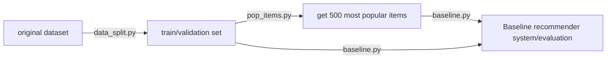
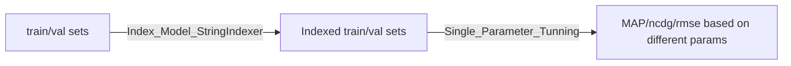
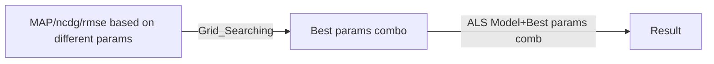

# Recommender Systems - Team 6 Introduction

A recommender system built in PySpark and designed for HPC environment. Submitted as term project for DS-GA 1004 Big Data at NYU.

This Introduction is written in Markdown and to give an overview of the project.

## Description of files:
- `Intro.md`: This file
- `README.md`: The original instruction file for the project
- `schema.py`: Explore the schema of the parquet files
    > Usage: $ spark-submit --deploy-mode client schema.py <file_path>
    - Schema of 'tracks' file:
        - recording_msid: string (nullable = true)
        - artist_name: string (nullable = true)
        - track_name: string (nullable = true)
        - recording_mbid: string (nullable = true)
    
    - Schema of 'users' file:
        - user_id: integer (nullable = true)
        - user_name: string (nullable = true)

    - Schema of 'interactions' file:
        - user_id: integer (nullable = true)
        - recording_msid: string (nullable = true)
        - timestamp: timestamp (nullable = true)

- `data_split.py`: This file return a validation set and a training data
    > spark-submit --deploy-mode client data_split.py
    - We have tried to ignore the users who have less than 50 interactions, but the number of results is still too many, so we decide to ignore the users who have less than 100 interactions. 20,409,672 interactions are left in the training set after splitting, and 5103798 interactions are left in the validation set.
- `count.py`: This file counts the number of times each user_id listen to different tracks, and output the result to a parquet file
    > Usage: $ spark-submit --deploy-mode client count.py
    - Schema of the output file:
        - user_id: integer (nullable = true)
        - recording_msid: string (nullable = true)
        - count: long (nullable = true)
- `pop_items.py`: This file returns the most popular items(500)
    > Usage: $ spark-submit get_popular_items.py <file_path>
    - Schema of the output file:
        - recording_msid: string (nullable = true)
- `baseline.py`: This file contains the baseline model
    > $ spark-submit --driver-memory 8g --executor-memory 8g baseline.py hdfs:/user/zz4140/1004-project-2023/items_popular.parquet hdfs:/user/zz4140/1004-project-2023/validation_sort.parquet
    - Returns:
        - Precision at 15
        - MAP
        - NDCG

## Roadmap:
-`Baseline model`:

-`ALS model`:

